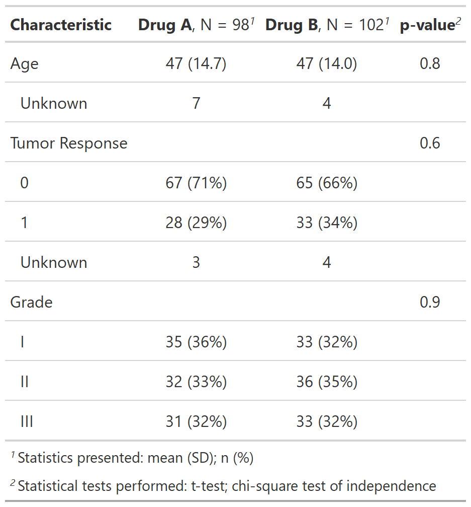

class: inverse, center, middle

# Summarizing Data Set with tbl_summary()

---
# Summarize data with tbl_summary()

.large[**Example: Summarizing clinical study data**]

.pull-left[
.large[

**Goal**: Compare select variables between treatment and control groups:
- Age
- Tumor Response
- Tumor Grade

]
```{r, results = FALSE}
sm_trial <-
  trial %>%
  select(trt, age, response, grade)
```

```{r, include = FALSE}
gt_trial_info <-
  tibble(
    Variable = names(sm_trial),
    Label = map_chr(Variable, ~attr(trial[[.x]], "label"))
  ) %>% gt::gt()
my_gtsave("gt_trial_info")
```

]
.pull-right[
<p align="center"></p>
]

???
- This is an abbreviated version of the example data used in the package help files/documentation. 

---
# {gtsummary} summarize data with tbl_summary()
.pull-left[
.large[
**The Basic tbl_summary() Code**
]

```{r, results = FALSE}
tbl_summary_1 <- 
  sm_trial %>%
  tbl_summary(by = trt) %>%
  add_p()
```
```{r, include=FALSE}
my_gtsave("tbl_summary_1")
```
.medium[
- Default statistics are median (IQR) for continuous variables, and n (percent) for categorical data.

- By default, variables coded as 0/1, TRUE/FALSE, and Yes/No are presented dichotomously.

- add_p() - default tests are the Wilcoxon rank-sum test for continuous variables, chi-square test of independence/ Fisher's exact test for categorical (Fisher's for low expected counts).
]
]
.pull-right[
<br>
<br>
<p align="center"></p>
]

???
- Go slow here

- summarizing a data set is the MOST important analysis

- summarize data first!  you will often catch mistakes.  Data is complicated, and understanding it up front is important.

- Communicating a summary of the data ALONG with analytic results in necessary (others may catch mistakes you're not aware of)

- {gtsummary} is for presenting results, other great packages are available for summarizing data for your self (e.g. skimr)

- just one line of code

- all functions beginning with `tbl_*` create a new tables

- this is how I used the package 95% percent of the time...so easy

- three types of data shown here (explain them)

---
# {gtsummary} summarize data with tbl_summary()

.pull-left[
.large[
**Start Customizing Using Arguments**
]

```{r, results = FALSE}
tbl_summary_3 <- 
  sm_trial %>%
  tbl_summary(
    by = trt,
    statistic = list(
      all_continuous() ~ "{mean} ({sd})",
      all_categorical() ~ "{n} / {N} ({p}%)"), 
    label = vars(age) ~ "Patient Age") %>%
  add_p(test = all_continuous() ~ "t.test")
```
```{r, include=FALSE}
my_gtsave("tbl_summary_3")
```

.medium[
- `statistic` - Report mean and standard deviation for continuous (default is median)
- `label` - Specify label for age
- `type` - Specify variable types
- `digits` - Specify number of decimals to round to
- `test`  [`add_p()`] - Report t-test p-values all continuous (default is Wilcoxan Rank Sum)
]
]
.pull-right[
<p align="center"></p>
]

???

- defaults are great, let's change the default behavior

- statistics can be changed to anything...literally any R function (e.g. variance)

- discuss the formula notation
    - it's like `case_when()`, condition/variable on LHS and result on RHS
    - one formula doesn't need to be in a list, but more than one must be listed

- the vignette has examples with more examples


---
# {gtsummary} tbl_summary() Formulas
.large[
**Formulas**


- Most arguments to `tbl_summary()` now require formula syntax, and provide many more options to easily select the table variables you want to modify.   
<br>
<br>

.center[

**select variables ~ specifiy what you want to do** 
]
]

???
- case_when uses similar syntax 
---
# {gtsummary} tbl_summary() Formulas
.large[
**Formulas**


- Most arguments to `tbl_summary()` now require formula syntax, and provide many more options to easily select the table variables you want to modify.   

.center[

<br>

**select variables ~ specifiy what you want to do** 

]

```{r, eval = FALSE}
tbl_summary(
  by = trt,
  statistic = age ~ "{mean} ({sd})" 
)
```
]


---
# {gtsummary} tbl_summary() Formulas
.large[
**Formulas**
.center[

**select variables ~ specifiy what you want to do** 
]

- **select variables**
    - use variable name, e.g. `age ~ ...` or `c(age, grade) ~ ...`
    - use any {tidyselect} functions, e.g. `contains("stage") ~ ...`
    - use summary type, e.g. `all_continuous() ~ ...`
    
- **specifiy what you want to do** (depends on the argument)
    - change the statistic you report using {glue} syntax. e.g `statistic = ... ~ "{mean} ({sd})"`
    - pass a string to change labels 
]

---
# {gtsummary} tbl_summary() Formulas

.pull-left[
```{r, results = FALSE}
tbl_summary_4 <- 
  sm_trial %>%
  tbl_summary(
    by = trt,
    type = vars(response) ~ "categorical",  #<<
    statistic = all_continuous() ~ "{mean} ({sd})",  #<<
    digits = vars(age) ~ c(0, 1)  #<<
  ) %>%
  add_p(test = all_continuous() ~ "t.test") 
```
```{r, include=FALSE}
my_gtsave("tbl_summary_4")
```
.large[
- Report levels for the response variable.
- Report mean instead of median (using glue)
- Modify the default rounding for age.


]
]
.pull-right[
<p align="center"></p>
]

???

- further discuss formula notation
    - just like {gt} can use both select helpers OR characters vector of names

- discuss digits and how it's used

- discuss `stat_label = `, and mention the footnote was omitted

---
# {gtsummary} summarize data with tbl_summary()

.large[
**New `tbl_summary` Features**

- Use tidyselect and additional selector functions for arguments 

- Write custom functions for calculating p-values 

- Table footnotes (you can optionally exclude these using `as_gt(exclude = "footnote_stat_label")` )

- Sort variables by significance (`sort_p()`)

- Calculate cell percents and row percents (default is column-wide)

- Only report p-values for select variables (`add_p(exclude = ...)`)

- Improved rounding options and ability to set global options for rounding p-values

]

???
- these are new features many added by request

---
# {gtsummary} tbl_summary() advanced customization
.large[**Advanced Customization Using {gt}**

- It's natural a {gtsummary} package user would want to customize the aesthetics of the table with one or more of the many {gt} functions available.  

- Every function in {gt} is available to use with a {gtsummary} object.

1. Create a {gtsummary} table.

1. Convert the table to a {gt} object with the `as_gt()` function.

1. Continue formatting as a {gt} table with any {gt} function.
]

???

Discuss `as_gt()` and how to use

---
# {gtsummary} tbl_summary() advanced customization
.large[**Advanced Customization Using {gt}**

- tab_header() - add a table title

- tab_spanner() - add headers that span columns

- tab_options() - change table padding and font size

- tab_footnote() - add additional footnotes to table

And many more! https://gt.rstudio.com/
]

---
class: left
# {gtsummary} summarize data with tbl_summary()

.large[
Review the tbl_summary vignette for more details
http://www.danieldsjoberg.com/gtsummary/articles/tbl_summary.html
]

.pull-left[.large[
- Reporting any statistic for continuous variables, including user-written functions.

- More on dichotomous variables and how to specify the level printed.

- Missing data options (e.g. report as a column rather than a row, always report N missing even when no missing data, modify missing text, etc.).
]]
.pull-right[.large[
- Sort categorical variables by frequency.

- Report row percent, rather than column percent.

- Report q-values from various methods like false discovery rate.

- Sort data by ascending p-values when comparisons have been made.
]]

???

There is more that we are not covering here