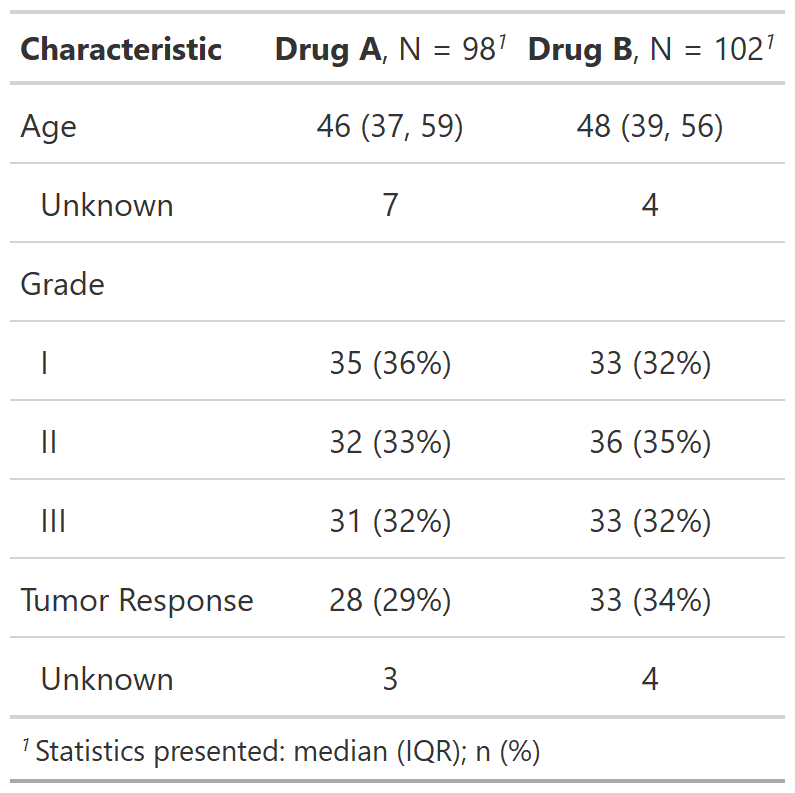

class: inverse, center, middle

# Summarizing Data Frames with tbl_summary()

---
# summarize data with tbl_summary()

.large[**Example: Summarizing clinical study data**]

.pull-left[
.large[

**Goal**: Summarize data by treatment groups:
- Age
- Tumor Response
- Tumor Grade
]
```{r, results = FALSE}
library(gtsummary)
library(tidyverse)

sm_trial <-
  trial %>%
  select(trt, age, grade, response)
```

```{r, include = FALSE}
gt_trial_info <-
  tibble(
    Variable = names(sm_trial),
    Label = map_chr(Variable, ~attr(trial[[.x]], "label"))
  ) %>% gt::gt()
my_gtsave("gt_trial_info")
```

]
.pull-right[
<p align="center"></p>
]

???
- This is an abbreviated version of the example data used in the package help files/documentation. 

- note that the column have been labeled using the {labelled} package, and those are used throughout the package

---
# summarize data with tbl_summary()
.pull-left[
.large[
**Basic tbl_summary() code**
]

```{r, results = FALSE}
tbl_summary_1 <- 
  sm_trial %>%
  tbl_summary(by = trt)
```
```{r, include=FALSE}
my_gtsave("tbl_summary_1")
```
.medium[
- Default statistics are median (IQR) for continuous variables, and n (percent) for categorical data.

- By default, variables coded as 0/1, TRUE/FALSE, and Yes/No are presented dichotomously.

- add_p() - default tests are the Wilcoxon rank-sum test for continuous variables, chi-square test of independence/ Fisher's exact test for categorical (Fisher's for low expected counts).
]
]
.pull-right[
<br>
<br>
<p align="center"></p>
]

???
- Go slow here

- summarizing a data set is the MOST important analysis

- summarize data first!  you will often catch mistakes.  Data is complicated, and understanding it up front is important.

- Communicating a summary of the data ALONG with analytic results in necessary (others may catch mistakes you're not aware of)

- {gtsummary} is for presenting results, other great packages are available for summarizing data for your self (e.g. skimr)

- just one line of code

- all functions beginning with `tbl_*` create a new tables

- this is how I used the package 95% percent of the time...so easy

- three types of data shown here (explain them)

---
# summarize data with tbl_summary()

.pull-left[
.large[
**Start Customizing Using Arguments**
]

```{r, results = FALSE}
tbl_summary_2 <- 
  sm_trial %>%
  tbl_summary(
    by = trt,
    statistic = list(
      all_continuous() ~ "{mean} ({sd})",
      all_categorical() ~ "{n} / {N} ({p}%)"), 
    label = age ~ "Patient Age")
```
```{r, include=FALSE}
my_gtsave("tbl_summary_2")
```

.medium[
- `statistic` - Report mean and standard deviation for continuous (default is median)
- `label` - Specify label for age
- `type` - Specify variable types
- `digits` - Specify number of decimals to round to
]
]
.pull-right[
<p align="center"></p>
]

???

- defaults are great, let's change the default behavior

- statistics can be changed to anything...literally any R function (e.g. variance)

- discuss the formula notation
    - it's like `case_when()`, condition/variable on LHS and result on RHS
    - one formula doesn't need to be in a list, but more than one must be listed

- the vignette has examples with more examples

---
# {gtsummary} and formulas
.large[

Many arguments use formula syntax (or list of formulas), and provide many  options to easily select variables you want to modify.   
<br>
<br>

.center[

**_select variables_ ~ specify what you want to do** 
]


- `label = list(age ~ "Patient Age", marker ~ "Marker Level Pre-Tx")`
- `type = c(age, marker) ~ "continuous"`
- `digits = list(age ~ 0, marker ~ 2)`
- `statistic = all_continuous() ~ "{median} [{min}, {max}]"`

]

???
- case_when uses similar syntax 

---
background-image: url(images/Dan-tbl_summary_small_example.png)
background-position: center
background-size: cover

---
# tbl_summary() + helper functions

.large[
`tbl_Summary()` objects can also be updated using related functions.

- `add_*()` add additional column of statistics or information
    - `add_p()`, `add_q()`, `add_overall()`, `add_n()`, `add_stat()`, `add_stat_label()`

- `modify_*()` modify table headers, spanning headers, and footnotes
    - `modify_header()`, `modify_spanning_header()`, `modify_footnote()`
    
- `bold_*()/italicize_*()` style labels, variable levels, significant p-values
    - `bold_labels()`, `bold_levels()`, `italicize_labels()`, `italicize_levels()`

]

???
The modify functions and the bold functions work on ALLL gtsummary tables


---
background-image: url(images/Dan-tbl_summary_big_example.png)
background-position: center
background-size: cover