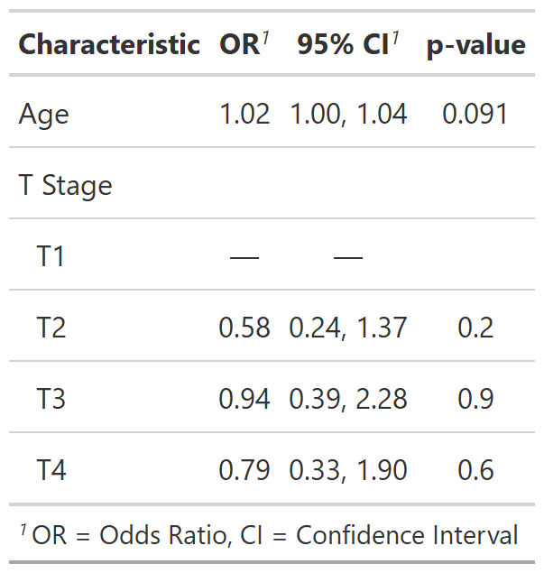
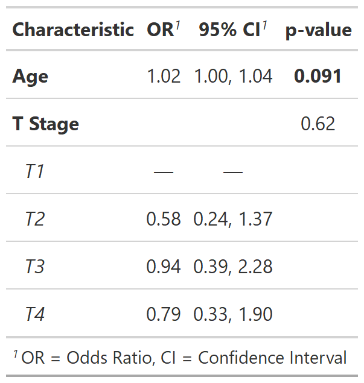

class: inverse, center, middle

# Summarizing Regression Models with
# tbl_regression()

---
# summarize models with tbl_regression()

.large[
**Goal**: Summarize a logistic regression model predicting tumor response
]
.pull-left[

.small[
```{r, results = FALSE}
library(gtsummary)
library(tidyverse)

m1 = glm(response ~ age + stage,
         data = trial,
         family = binomial(link = "logit"))

summary(m1)
```
]
.large[
- Display **odds ratio** estimates and **confidence intervals**

- Display covariate **p-values**

- Show **reference levels** for categorical variables
]

]


.pull-right[

.small[
```{r, echo=FALSE}
summary(m1)
```
]
]


---
# summarize models with tbl_regression()

.large[
**basic tbl_regression() code**
]

.pull-left[

```{r, results = FALSE}
tbl_logreg <- 
  tbl_regression(m1, exponentiate = TRUE)
```
```{r, include=FALSE}
my_gtsave("tbl_logreg")
```

.large[
- **Reference rows** are created for categorical variables

- **Variable labels** are displayed 

- Coefficients are exponentiated and **Odds Ratios** are displayed
]
]
.pull-right[
<p align="center"></p>
]

???
- Model estimates and confidence intervals are rounded and nicely formatted.

- P-values above 0.9 are presented as “>0.9” and below 0.001 are presented as “<0.001”. Non-significant p-values are only rounded to one decimal, while those close to or below the significance threshold (default 0.05) have additional decimal places by default.

- Variable levels are indented and footnotes are added if printed using {gt}. (can alternatively be printed using knitr::kable(); see options here)


---
# summarize models with tbl_regression()
.large[
**customize regression tables**
]
.pull-left[

```{r, results = FALSE, message=FALSE, warning=FALSE}
tbl_logreg2 <-
  tbl_regression(m1,
    exponentiate = TRUE,
    pvalue_fun =
      ~style_pvalue(.x, digits = 2)) %>%
  bold_labels() %>%
  italicize_levels() %>%
  add_global_p() %>%
  bold_p(t = .1)
```
```{r, include=FALSE}
my_gtsave("tbl_logreg2")
```

.medium[
- `exponentiate` - Exponentiate model coefficients to display ORs
- `pvalue_fun` - Round and format p-values
- `add_global_p()` - Calculate global p-values for categorical variables
- `bold_p()` - Bold p-values at a specific threshold
]
]

.pull-right[
<p align="center"></p>
]

???
- use arguments and helper functions to customize


---
background-image: url(images/tbl_regression_markup.png)
background-position: center
background-size: contain

---

# tbl_uvregression() Univariate Summaries
.large[
**basic tbl_uvregression() code**
]
.pull-left[
```{r, results = FALSE}
tbl_uvreg <- 
  trial %>% 
  select(age, stage, grade, response) %>%
  tbl_uvregression(
    method = glm,
    y = response,
    method.args = list(family = binomial),
    exponentiate = TRUE)
```
```{r, include=FALSE}
my_gtsave("tbl_uvreg")
```

.medium[
- Specify  model `method`, `method.args`, and the `response` variable

- Arguments and helper functions like `exponentiate`, `bold_*()`, `add_global_p()` can also be used with `tbl_uvregression()`
]
]
.pull-right[
<p align="center"></p>
]

???
- OR was recognized due to exponentiate arg


---

# inline reporting with inline_text()

<p align="center"></p>

.medium[
**In Code:** 
The odds ratio for age is '` r inline_text(tbl_logreg2, variable = age)`'

**In Report:** 
The odds ratio for age is `r inline_text(tbl_logreg2, variable = age)`
]


---

# tbl_merge() and tbl_stack()

Possible just a figure/schematic here

