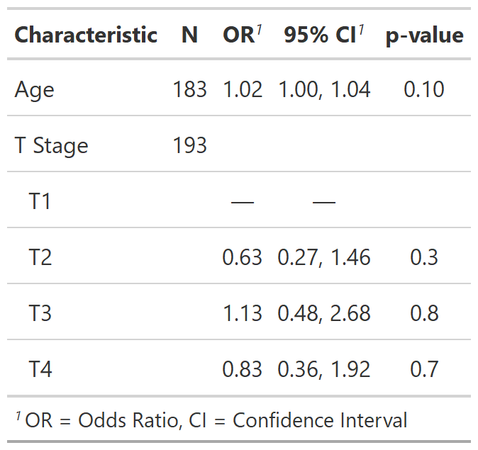

class: inverse, center, middle

# Summarizing Regression Models with
# tbl_regression()

---
# summarize models with tbl_regression()

.large[**Example: Summarizing regression models**]

.pull-left[
.large[

**Goal**: Summarize a logistic regression model predicting tumor response
  
**Basic tbl_regression() code**
]

```{r, results = FALSE}
library(gtsummary)
library(tidyverse)

m1 = glm(response ~ age + stage + grade,
         data = trial,
         family = binomial(link = "logit"))
tbl_logreg <- tbl_regression(m1, exponentiate = TRUE)

```
]

```{r, include=FALSE}
my_gtsave("tbl_logreg")
```

.pull-right[
<p align="center"></p>
]


---
# summarize models with tbl_regression()
.pull-left[
.large[
**Basic tbl_regression() code**
]

```{r, results = FALSE}
m1 = glm(response ~ age + stage,
         data = trial,
         family = binomial(link = "logit"))
tbl_logreg <- 
  tbl_regression(m1, exponentiate = TRUE)
```
```{r, include=FALSE}
my_gtsave("tbl_logreg")
```

.medium[
- Variable types are automatically detected and reference rows are created for categorical variables.

- Variable labels are carried through into the output table (if no labels, variable names are used). 

- The model was recognized as logistic regression with coefficients exponentiated, so the header displayed “OR” for odds ratio.
]
]
.pull-right[
<p align="center"></p>
]

???
- Model estimates and confidence intervals are rounded and nicely formatted.

- P-values above 0.9 are presented as “>0.9” and below 0.001 are presented as “<0.001”. Non-significant p-values are only rounded to one decimal, while those close to or below the significance threshold (default 0.05) have additional decimal places by default.

- Variable levels are indented and footnotes are added if printed using {gt}. (can alternatively be printed using knitr::kable(); see options here)


---
# summarize models with tbl_regression()
.pull-left[
.large[
**Customize Regression Tables**
]

```{r, results = FALSE, message=FALSE, warning=FALSE}
tbl_logreg2 <- 
  tbl_regression(m1,
                 exponentiate = TRUE, 
                 label = vars(age) ~ "Age, yrs", 
                 pvalue_fun = function(x) {
                   style_pvalue(x, digits = 2)
                   }) %>%
  bold_labels() %>%
  italicize_levels() %>%
  add_global_p() %>%
  bold_p(t = .1)
```
```{r, include=FALSE}
my_gtsave("tbl_logreg2")
```

.medium[
- `exponentiate` - Exponentiate model coefficients to display ORs
- `label` - Specify label for age
- `pvalue_fun` - Round and format p-values
- `add_global_p()` - Calculate global p-values for categorical variables
- `bold_p()` - Bold p-values under threshold of .1
]
]

.pull-right[
<p align="center"></p>
]

???
- use arguments and helper functions to customize


---
background-image: url(images/tbl_regression_markup.png)
background-position: center
background-size: contain

---

# tbl_uvregression()
.pull-left[
.large[
**Basic tbl_uvregression() code**
]

```{r, results = FALSE}
tbl_uvreg <- 
  trial %>% 
  select(age, stage, grade, response) %>%
  tbl_uvregression(
    method = glm,
    y = response,
    method.args = list(family = binomial),
    exponentiate = TRUE)
```
```{r, include=FALSE}
my_gtsave("tbl_uvreg")
```

.medium[
- Specify which method to use, any method arguments, and the response variable

- Arguments and helper functions like `exponentiate`, `bold_*`, `add_global_p()` are also available for `tbl_uvregression()`

]
]
.pull-right[
<p align="center"></p>
]

???
- OR was recognized due to exponentiate arg


