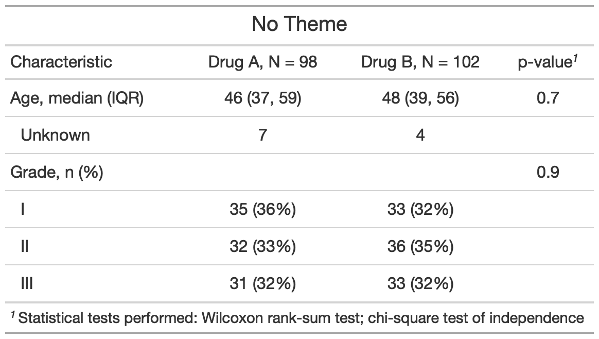

class: inverse, center, middle

# Advanced Customization with Themes

---
# {gtsummary} + Themes

.large[**Theme Basics**]

.large[
- A theme is a defined set of customization preferences that can be easily set and reused. 

- Themes can control default function behaviors (e.g. Always present mean instead of median for continuous variables in `tbl_summary()`)

- Themes can also control more fine-grained customization not available via arguments or helper functions (e.g. set packagewide language preference)

- Easily set one of the available package themes, or create your own personalized theme!

]


---
# {gtsummary} + Themes

.large[**Available Themes**]


```{r,results=FALSE, eval=FALSE, echo=FALSE}

# create themes gif 
reset_gtsummary_theme()
no_theme <- trial %>%
  dplyr::select(age, grade, trt) %>%
  tbl_summary(by = trt) %>%
  add_stat_label() %>%
    add_p() %>%
  as_gt() %>%
  gt::tab_header("No Theme")

my_gtsave("no_theme")

# --------
reset_gtsummary_theme()
theme_gtsummary_journal(journal = "jama")
jama_theme <- trial %>%
  dplyr::select(age, grade, trt) %>%
  tbl_summary(by = trt) %>%
  add_stat_label() %>%
  add_p() %>%
  as_gt() %>%
  gt::tab_header("JAMA Theme")

my_gtsave("jama_theme")

# ------
reset_gtsummary_theme()
theme_gtsummary_compact()

compact_theme <- trial %>%
  dplyr::select(age, grade, trt) %>%
  tbl_summary(by = trt) %>%
  add_stat_label() %>%
  add_p() %>%
  as_gt() %>%
  gt::tab_header("Compact Theme")

my_gtsave("compact_theme")
# -----

reset_gtsummary_theme()
theme_gtsummary_language(language = "ja")

lang_theme <- trial %>%
  dplyr::select(age, grade, trt) %>%
  tbl_summary(by = trt) %>%
  add_stat_label() %>%
  add_p() %>%
  as_gt() %>%
  gt::tab_header("Language Theme")

my_gtsave("lang_theme")

# Make GIF

files <- list.files(here::here("images"), full.names = TRUE)
imgs <- rev(files[str_detect(files, "theme")])

img_list <- lapply(imgs, image_read)
img_joined <- image_join(img_list)
img_animated <- image_animate(img_joined, fps = 1)

image_write(image = img_animated,
            path = here::here("images", "themes.gif"))

```

.pull-left[
.large[

- Use `theme_gtsummary_jornal()` to format to specific publication guidelines.

- Use `theme_gtsummary_language()` to translate tables

- Use `theme_gtsummary_compact()` to reduce default padding and font size of tables

]
]


.pull-right[
<p align="center"></p>
]

???
- journal theme- for example, large p-values are rounded to two decimal places, IQR sep with dash rather than comma, percent symbol removed. RIght now we have JAMA and lancet, but will likely expand options in the future

- language theme - Currently 12 different languages available and looking to expand

- Any of these can be layered, for example you can use compact and language together. and you only have to set once a session. 

---
# {gtsummary} + Themes

.large[**Create Your Own Theme**]

.pull-left[
.medium[

- A theme is just a named list of customization elements (glossary of available theme element options in docs)
- A few examples of what you can customize with themes:
    - Always style p-values, to X number of digits
    - Set default statistical tests to use (e.g. always use `fisher.test` for categorical)
    - Specify large number separator (e.g. 1.000 vs. 1,000)
    - Always sort categorical variables by frequency
    - And MANY MORE!

]
]

.pull-right[
.large[

```{r, eval=FALSE}
karissa_theme <-   
  list(
    # round large p-values to two places
    "pkgwide-fn:pvalue_fun" = function(x) style_pvalue(x, digits = 2),
    "add_p.tbl_summary-attr:test.categorical" = "fisher.test", 
    # report median (IQR) and n (percent) as default stats in `tbl_summary()`
    "style_number-arg:big.mark" = ".",
    "tbl_summary-arg:sort" = all_categorical() ~ "frequency"
  )

set_gtsummary_theme("karissa_theme")
```


]
]


