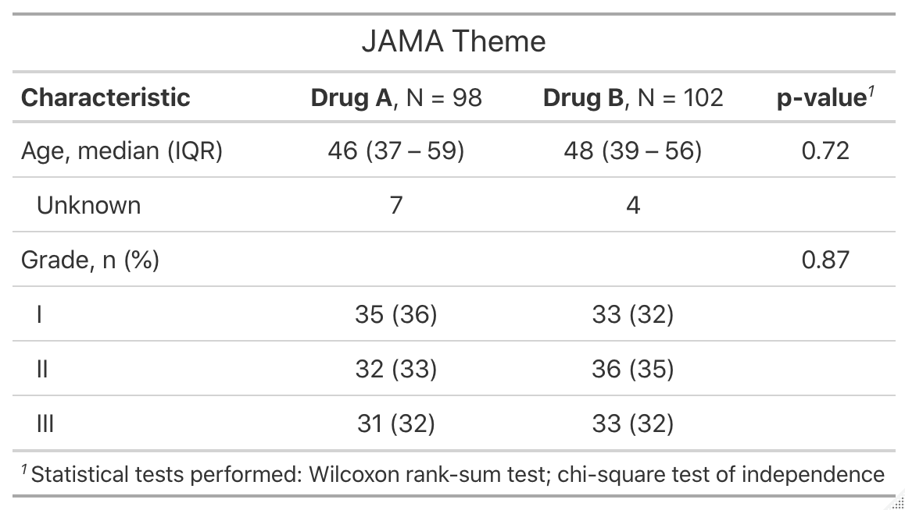
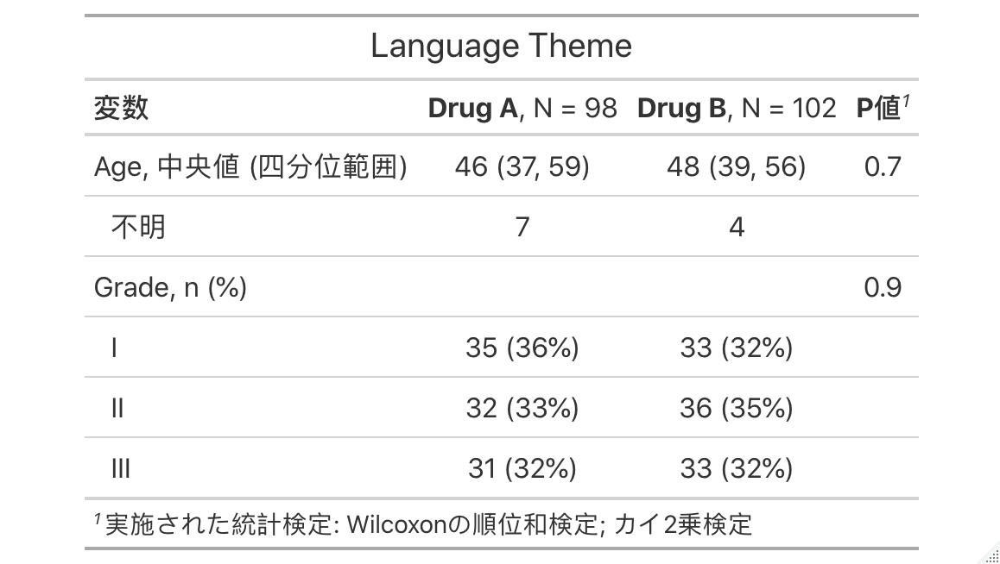
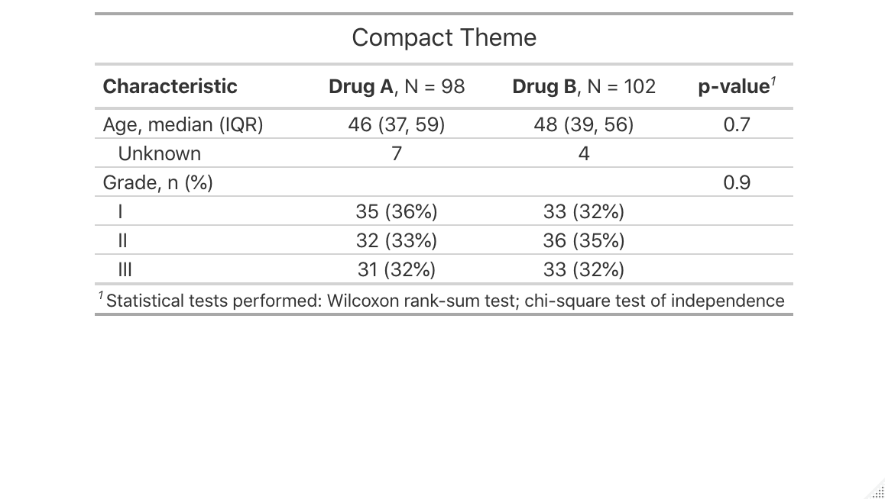
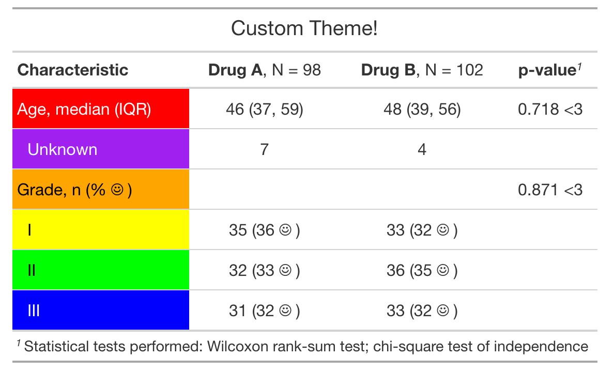

class: inverse, center, middle

# advanced customization with themes

---
# {gtsummary} + Themes

.large[**Theme Basics**]

.large[
- A **theme** is a defined set of customization preferences that can be easily set and reused. 

- Themes control **default settings for existing functions** (e.g. always present mean instead of median in `tbl_summary()`)

- Themes control more **fine-grained customization** not available via arguments or helper functions

- Easily use one of the **available package themes**, or **create your own**!

]

???


---
# {gtsummary} + Themes

.large[**Available Themes**]


```{r,results=FALSE, eval=FALSE, echo=FALSE}

# create themes gif 
reset_gtsummary_theme()
no_theme <- trial %>%
  dplyr::select(age, grade, trt) %>%
  tbl_summary(by = trt) %>%
  add_stat_label() %>%
    add_p() %>%
  as_gt() %>%
  gt::tab_header("No Theme")

my_gtsave("no_theme")

# --------
reset_gtsummary_theme()
theme_gtsummary_journal(journal = "jama")
jama_theme <- trial %>%
  dplyr::select(age, grade, trt) %>%
  tbl_summary(by = trt) %>%
  add_stat_label() %>%
  add_p() %>%
  as_gt() %>%
  gt::tab_header("JAMA Theme")

gt::gtsave(jama_theme, here::here("jama_theme.png"))   

my_gtsave("jama_theme")

# ------
reset_gtsummary_theme()
theme_gtsummary_compact()

compact_theme <- trial %>%
  dplyr::select(age, grade, trt) %>%
  tbl_summary(by = trt) %>%
  add_stat_label() %>%
  add_p() %>%
  as_gt() %>%
  gt::tab_header("Compact Theme")

my_gtsave("compact_theme")
# -----

reset_gtsummary_theme()
theme_gtsummary_language(language = "ja")

lang_theme <- trial %>%
  dplyr::select(age, grade, trt) %>%
  tbl_summary(by = trt) %>%
  add_stat_label() %>%
  add_p() %>%
  as_gt() %>%
  gt::tab_header("Language Theme")

my_gtsave("lang_theme")

# Make GIF

files <- list.files(here::here("images"), full.names = TRUE)
imgs <- rev(files[str_detect(files, "theme")])

img_list <- lapply(imgs, image_read)
img_joined <- image_join(img_list)
img_animated <- image_animate(img_joined, fps = 1)

image_write(image = img_animated,
            path = here::here("images", "themes.gif"))

```

.pull-left[
.large[

]
]

.pull-right[
<p align="center"></p>
]

---
# {gtsummary} + Themes

.large[**Available Themes**]

.pull-left[
.large[

- `theme_gtsummary_jornal()` - formats tables to specific publication guidelines.


]
]

.pull-right[
<p align="center"></p>
]

---
# {gtsummary} + Themes

.large[**Available Themes**]

.pull-left[
.large[

- `theme_gtsummary_jornal()` - formats tables to specific publication guidelines.

- `theme_gtsummary_language()` - translates table text


]
]

.pull-right[
<p align="center"></p>
]

---
# {gtsummary} + Themes

.large[**Available Themes**]

.pull-left[
.large[

- `theme_gtsummary_jornal()` - formats tables to specific publication guidelines.

- `theme_gtsummary_language()` - translates table text

- `theme_gtsummary_compact()` - reduces padding and font size

]
]

.pull-right[
<p align="center"></p>
]

---
# {gtsummary} + Themes

.large[**Available Themes**]

.pull-left[
.large[

- `theme_gtsummary_jornal()` - formats tables to specific publication guidelines.

- `theme_gtsummary_language()` - translates table text

- `theme_gtsummary_compact()` - reduces padding and font size

- `set_gtsummary_theme("my_theme")` - create your own!

]
]

.pull-right[
<p align="center"></p>
]

