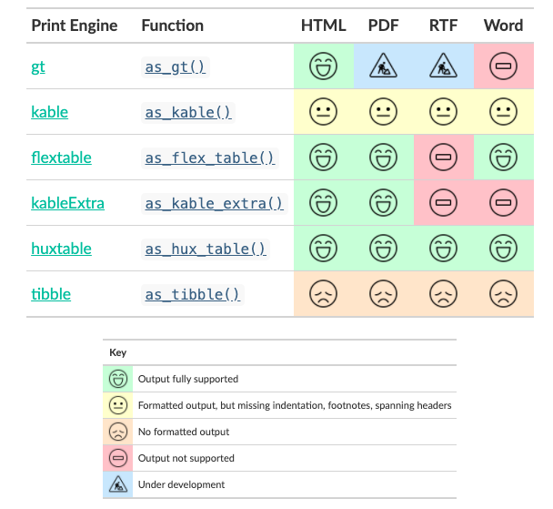
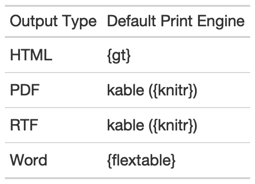

class: inverse, center, middle

# Printing {gtsummary} Tables 

---
# {gtsummary} + R Markdown
.left-column[ 
.large[
{gtsummary} tables are **compatible with most R Markdown outputs** and tables can be printed using a number of print methods. 
]
]
.right-column[ 
<p align="center"></p>
]

---
# {gtsummary} + R Markdown

.large[
- **Sensible print engine defaults** help chose the print engine most suited your output format. 

- Easily override these defaults with conversion functions
    - e.g. `as_gt()`, `as_flex_table()`...

- Or specify preferred print engines in a custom theme

]

```{r, include = FALSE}
print_engine_defaults <-
  tribble(
    ~ "Output Type", ~"Default Print Engine", 
    "HTML", "{gt}",
    "PDF", "kable ({knitr})", 
    "RTF", "kable ({knitr})", 
    "Word", "{flextable}") %>% gt::gt() %>%
  gt::tab_options(column_labels.font.weight = "bold")

my_gtsave("print_engine_defaults")
```

<p align="center"></p>
